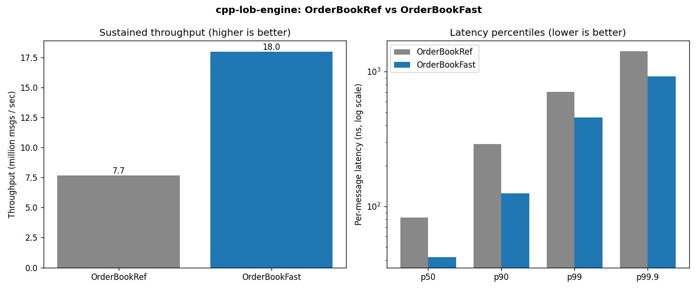

# Benchmarks

Real, measured numbers comparing the reference engine (`OrderBookRef`) against
the optimised engine (`OrderBookFast`) on identical workloads. Reproduce with:

```bash
cmake -S . -B build -DCMAKE_BUILD_TYPE=Release && cmake --build build -j
./build/lob_bench_harness 2000000 7          # writes docs/bench_results.csv
./build/lob_microbench                        # Google Benchmark
python analytics/plot_bench.py                # writes docs/bench_perf.png
```

## Machine, compiler, flags

| | |
|---|---|
| CPU      | Apple M4 (10 cores) |
| RAM      | 16 GB |
| OS       | macOS 15.7 (Darwin 24.6, arm64) |
| Compiler | Apple Clang 17.0.0 |
| Build    | `CMAKE_BUILD_TYPE=Release` → `-O3 -DNDEBUG`, C++20 |
| Workload | 2,000,000 synthetic messages, seed 2024 (default generator mix: ~70% limit / 20% cancel / 6% market / 4% modify, 18% of limits aggressive) |

## Methodology

- **Throughput** — the full 2M-message stream is replayed end-to-end through a
  freshly-constructed book; we report the **median of 7 runs** (messages/sec)
  after an untimed warm-up pass to prime caches and branch predictors. The event
  sink is a counting sink so matching work cannot be optimised away.
- **Latency** — every `submit()` is individually timed with
  `std::chrono::steady_clock`; we report the p50 / p90 / p99 / p99.9 / max of the
  2M samples. These figures **include timer overhead** (≈ tens of ns on this
  machine), which is why p50 is clock-limited and the *tail* is the more
  informative comparison. We do not subtract overhead.
- **Microbenchmarks** — Google Benchmark drives full-replay and add/cancel-churn
  cases with its own adaptive iteration counts and statistics.

## Results — latency/throughput harness

`./build/lob_bench_harness 2000000 7 2024`

| Engine          | Throughput (Mmsg/s) | p50 (ns) | p90 (ns) | p99 (ns) | p99.9 (ns) | max (ns) |
|-----------------|--------------------:|---------:|---------:|---------:|-----------:|---------:|
| `OrderBookRef`  | 7.67                | 83       | 291      | 709      | 1416       | 12,542,209 |
| `OrderBookFast` | **18.00**           | 42       | 125      | 458      | 917        | 508,791  |

**Throughput speedup: 2.35×.** The optimised engine also tightens the tail at
every percentile (p90 2.3×, p99 1.5×, p99.9 1.5×, max 25× lower) — the flat
tick-indexed levels and allocation-free pool remove the `std::map` node-allocation
and rebalancing spikes that drive the reference engine's worst case.



## Results — Google Benchmark microbenchmarks

`./build/lob_microbench`

| Benchmark            | Time / item | Throughput     |
|----------------------|------------:|----------------|
| `BM_Replay_Ref/200k`   | —          | 10.37 Mmsg/s   |
| `BM_Replay_Fast/200k`  | —          | **24.40 Mmsg/s** (2.35×) |
| `BM_AddCancel_Ref`     | 90.0 ns    | —              |
| `BM_AddCancel_Fast`    | **28.6 ns** | — (3.1×)      |

The add/cancel churn case isolates the resting-order path: `OrderBookFast`'s
pool allocation + intrusive unlink + span-bounded best-price maintenance is ~3×
the reference's `std::map`/`std::list` insert+erase. (An earlier version scanned
the whole tick domain to refresh the best price when a side emptied — fixed by
bounding the re-scan to the occupied price span; see `docs/DESIGN.md`.)

## Takeaways

- Both engines produce **identical output** (the golden cross-validation test),
  so this is a like-for-like comparison of data-structure cost, not behaviour.
- The win comes from `O(1)` tick-indexed access, zero per-message heap
  allocation, and cache-friendly contiguous levels — not from algorithmic
  cleverness in the matching loop, which is the same in both.
- The latency p50 is dominated by timer overhead; the throughput and tail
  numbers are the honest performance signal.
